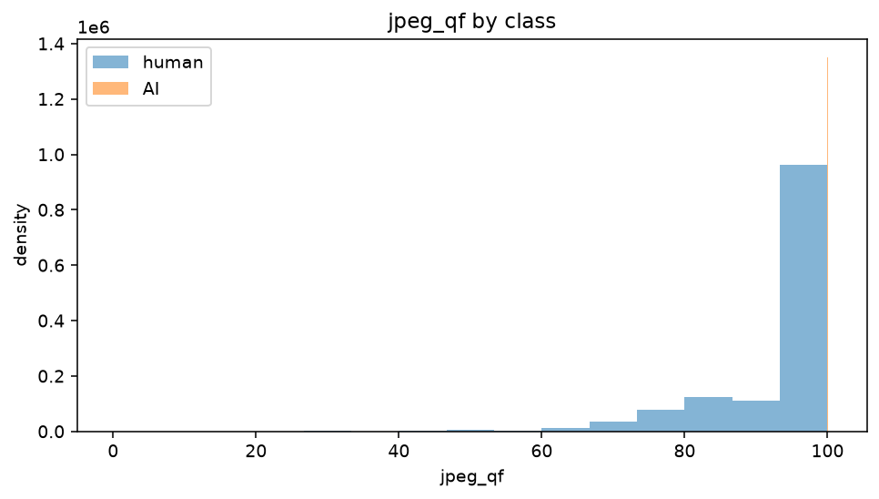

# AI Image Detection
As artificial intelligence advances, the boundary between authentic and synthetic imagery is becoming increasingly difficult to distinguish. This is an end-to-end image classifier that detects whether images are **AI-generated** or **human-made**. Currently a work-in-progress.

**Current stage:** Image data download and validation (i.e.- Checking for corrupted images, recording image metadata: dimensions, JPEG quality, image source, specific AI generator, real/AI labels, etc....) pipeline is complete. Currently working on image preprocessing and train/validation/test splitting prior to employing a deep learning model for training and evaluation.


## Table of Contents
- [AI Image Detection](#ai-image-detection)
  - [Table of Contents](#table-of-contents)
  - [1. Problem Definition](#1-problem-definition)
  - [2. Dataset Strategy](#2-dataset-strategy)
    - [Image Sources](#image-sources)
    - [bias-matching](#bias-matching)
    - [Preprocessing Strategy](#preprocessing-strategy)
    - [Image integrity checks (`Integrity.py`)](#image-integrity-checks-integritypy)
    - [Manifest Construction (`manifest.py`, `build_manifest.py`)](#manifest-construction-manifestpy-build_manifestpy)
    - [Splitting Philosophy](#splitting-philosophy)
  - [3. Project Structure (So far)](#3-project-structure-so-far)
  - [4. Setup](#4-setup)
  - [5. Usage](#5-usage)


## 1. Problem Definition

In a real-world setting there are three classes of images that we may encounter:

- **Fully synthetic:** text-to-image output - Stable Diffusion,
  Midjourney, DALL·E, etc.
- **Human-authored:** camera photos, scanned art, hand-made
  digital illustration.
- **AI-edited / hybrid** (in-painting, generative fill, upscaling, style
  transfer): This is currently out of the scope of this project, though robustness to these image types will be evaluated at a later stage.

Formally, this is binary classification problem where: given a pixel tensor $x \in \mathbb{R}^{H \times W \times 3}$ (i.e.- the numerical representation of an image), we predict whether the image is human-made or AI-generated ($y \in \{\text{human, AI}\}$)
using a probabilistic estimate within range $[0,1]$ where values closer to 1 indicate a higher likelihood of being AI-generated.

This is however not a straight-forward task. A model trained on one generator family (e.g.- Midjourney) tends to learn that family's fingerprint rather than "AI-ness" in general, so accuracy can collapse on an unseen generator (e.g.- DALL-E), a form of [distribution shift](https://parasdahal.com/notes/distribution-shift/).
This can be due to the following reasons: 

- If the two classes differ systematically in resolution/format/compression, etc..., a model will happily learn *that* instead (**shortcut learning**)
- Generator developers are actively optimizing to eliminate the very artifacts we are seeking to detect
- Real-world post-processing (resizing, recompressing, screenshots, re-upload) erodes forensic signal.


We aim to produce the best probabilistic estimate from a model fit to a specific distribution. That is: *image is likely AI-generated (model score 0.91)*. Our objective and scope for the project is therefore as follows: 
> Build a binary image classifier that, given a single still image, outputs a calibrated probability that the image was fully synthesized by a generative model.

> This classifier will be trained on multiple diffusion-family generators and multiple real-image sources, and evaluated primarily on both in-distribution and held-out generators rather than on i.i.d. (independent and identically distributed) sets.

## 2. Dataset Strategy

### Image Sources
Candidate sources include:
- **[GenImage](https://github.com/gendetection/UnbiasedGenImage)** (*Primary image source*) - ~1M
real (ImageNet) / fake pairs across 8 generators, with deliberate bias controls (matched sizes, controlled JPEG compression).
- **[Tiny GenImage](https://www.kaggle.com/datasets/yangsangtai/tiny-genimage)** - ~17,500 real/fake pairs across 7 generators, used for initial pipeline development and debugging.
- **[NTIRE Robust AIGen Detection](https://huggingface.co/datasets/deepfakesMSU/NTIRE-RobustAIGenDetection-train)** - 42 generators, unlabeled augmentations. Used later as a true wild/out-of-distribution test.
-  **[COCO](https://cocodataset.org/#overview)** - solely real images, used to assess the false-positive rate on an unseen real-image source.
- **[RAISE](https://loki.disi.unitn.it/RAISE/)** - uncompressed RAW-derived images; the hardest real-image shift.

**Metadata-level EDA (`01_genimage_metadata_eda.ipynb`):** before downloading actual image, the [GenImage metadata CSV](https://dataverse.harvard.edu/file.xhtml?fileId=9659368&version=2.0) (dimensions, generator, JPEG quality, class label) is analyzed on its own. This is what makes it possible to plan a dataset subset and catch shortcut learning risks without touching the images themselves.


### bias-matching

bias-matching is a data filtering technique designed to eliminate shortcut learning. A generative AI model can output images with distinct metadata: exact canvas dimensions (e.g.- 1024x1024) and consistent JPEG Quality Factors (QF) while *in contrast, real photos come in thousands of random resolutions and compression levels. If a raw dataset is fed to a deep learning model, the neural network may quickly utilize these shortcut signals to classify images. 

Still under metadata EDA, we therefore filter for real and fake images that share the exact same metadata profile, thereby eliminating any predictive signal from image metadata. The bias-matching method applied is however asymmetric where AI-generated images are left untouched and any real images that do not fit the metadata profile are filtered out. This asymmetric implementation is because AI-generated images occupy a narrower band of space compared to real images as they are constrained to their specific generators. Asymmetric bias-matching results in far fewer real images therefore a sufficient image dataset is paramount. 

We validate our bias-matching strategy by training a simple Decision Tree classifier on metadata alone. An accuracy score close to 50% (akin to a random guess) shortcut learning is successfully eliminated. The higher the accuracy score, the more bias is inherent in the metadata. The results are as follows:

```yaml
metadata-only accuracy BEFORE matching: 0.9960
metadata-only accuracy AFTER  matching: 0.9369
chance level:                           0.9693
```

Where chance level is the accuracy obtained by always predicting the majority class.

The reduction in accuracy justifies our strategy. We found the shortcut signal to primarily lie in JPEG QF where all AI images are encoded with JPEG QF = 100 compared to real images with varying compression values:




With this in mind we propose the following image preprocessing strategy: 

### Preprocessing Strategy

Even after bias-matched sampling, residual dimension/compression differences can leak through. The proposed preprocessing step therefore normalizes both signals directly:
- Re-encode images to a uniform JPEG quality factor (QF).
- Resize images to a uniform width and height.

### Image integrity checks (`Integrity.py`)

Every downloaded image is validated before being added to a manifest (see below [Manifest Construction](#manifest-construction) section) with validation methods including: corruption/truncation probing, SHA-256 hashing (exact-duplicate detection), and perceptual hashing (near-duplicate detection), plus JPEG quality estimation used by the bias-matching and preprocessing steps above. See `integrity.py` for full method descriptions.

### Manifest Construction (`manifest.py`, `build_manifest.py`)

A manifest is simply a table dataset of per-image metadata and labels (one row per image) that downstream steps (bias-matching, preprocessing, splitting) read and write rather than touching raw files. It's structured as follows:

| image_path | source | generator | label | width | height | jpeg_qf | sha256 |
|---|---|---|---|---|---|---|---|
| data/raw/genimage/sd_v1_4/000123.jpg | genimage | stable_diffusion_v_1_4 | fake | 512 | 512 | 92 | a1b2c3... |
| data/raw/coco/000456.jpg | coco | real | real | 640 | 480 | 88 | d4e5f6... |

The per-source outputs of the download, integrity and manifest recording steps (GenImage, Tiny GenImage, NTIRE, COCO, RAISE) are then combined into one unified manifest, which is the single input where everything downstream (i.e.- preprocessing, splitting, train/val/test) is built from.

### Splitting Philosophy

Maive random splitting leaks information via image duplicates/near-duplicates, similar content groups (e.g.- Images of a dog, cars, tables, planes, e.t.c.), and generator or source-specific signatures. Splits here are instead group-aware (duplicate clusters never cross a split), stratified by class/generator/content category, and include held-out-generator test sets so cross-generator generalization and not just in-distribution accuracy, gets measured. The manifest is split as follows:

| Split | Sources / Generators |
|---|---|
| `train` | stable_diffusion_v_1_4, stable_diffusion_v_1_5, glide, adm, vqdm |
| `test_ood_genimage` | midjourney, wukong, biggan |
| `test_wild` | test_wild |
| `test_ood_real` | COCO |
| `test_ood_real_uncompressed` | RAISE |

Within the `train` pool itself, a further **group-aware train/val/test_in_dist split** is applied: images are first clustered by near-duplicate/perceptual-hash groups (and, where applicable, paired real/fake origin), and whole groups - never individual images - are assigned to train, val, or test_in_dist. This prevents near-duplicate or paired images from appearing on both sides of a split, which would let the model "memorize" rather than generalize and would inflate validation/test metrics in a way that doesn't hold up on genuinely unseen data.

Starting scale is intentionally small to get the pipeline and evaluation trustworthy before scaling up to the full ~500GB GenImage dataset (or including additional image sources for training and testing).

## 3. Project Structure (So far)

```yaml
ai-image-detector/
├── README.md                          # this file
├── pyproject.toml                     # dependencies, dev tools (ruff, pytest), editable install
├── .gitignore                         # excludes data/, secrets, caches, notebook outputs
│
├── configs/
│   └── data/
│       └── subset_v1.yaml             # dataset selection specifications: in/out-of distribution generators, data splits, bias-matching thresholds
│
├── data/                              # gitignored - nothing here is committed
│   ├── raw/                           # immutable downloads (tiny_genimage/, coco/, genimage/, ...)
│   ├── interim/                       # work-in-progress manifests, EDA parquet files
│   └── processed/                     # final train/val/test manifests (not yet produced)
│
├── notebooks/
│   ├── 01_genimage_metadata_eda.ipynb # metadata-only EDA; decides dataset composition before downloading images
│   └── 02_image_level_eda.ipynb       # pixel-level EDA (dimensions, corruption, duplicates) - runs once images + manifest exist
│
├── reports/
│   ├── figures/                       # plots obtained from notebook EDA
│   ├── manifests/                     # final train/val/test manifests
│
├── scripts/                           # for one-off tasks such as downloading metadata/images, building manifests, etc.
│   ├── setup_git.sh                   # one-time repo/branch initialization
│   ├── download_genimage_metadata.py  # fetches the small GenImage metadata CSV (not the images)
│   ├── download_images.py             # downloads actual image data: tiny | coco | genimage | ntire | raise | plus download verification
│   └── build_manifest.py              # builds the dataset manifest from images on disk (next step)
│
├── src/ai_detector/                   # installable package - the reusable logic notebooks/scripts import
│   ├── data/
│   │   ├── integrity.py               # corruption checks, SHA-256, perceptual hashing, JPEG quality estimation
│   │   ├── manifest.py                # manifest schema (ImageRecord) and read/write logic
│   │   ├── selection.py               # applies configs/data/*.yaml: bias-matching, stratified sampling
│   │   ├── viz.py                     # reusable EDA plotting functions
│   │   └── download.py                # per-source download handlers used by scripts/download_images.py
│   └── utils/                         # logging, seeding, and other shared helpers
│
└── tests/
    └── test_data_integrity.py         # unit tests for image checking and manifest reading/writing modules in src
```


## 4. Setup

```bash
git clone <this-repo>
cd Ai_Image_Detector

python -m venv .venv
source .venv/bin/activate        # Windows PowerShell: .venv\Scripts\Activate.ps1

pip install --upgrade pip
pip install -e ".[dev]"          # editable install + pytest/ruff/jupyterlab/HuggingFace

bash scripts/setup_git.sh        # one-time: branch setup (read it first)
pytest                           # confirm everything is wired correctly
```

`-e` (editable) means edits under `src/ai_detector/` take effect immediately
without reinstalling - verify with:

```bash
python -c "from ai_detector.data.integrity import phash; print('ok')"
```

## 5. Usage

To reproduce the project's current state from scratch, run these in order:

**Step 1: Download GenImage metadata (not the images yet)**

```bash
python scripts/download_genimage_metadata.py --dest data/raw/genimage_meta
```

Fetches the small metadata CSV describing GenImage's ~1M images (dimensions,
generator, JPEG quality) and writes a `provenance.json` recording the source
URL, SHA-256, and download time. This is what lets you plan a dataset subset
without touching the 500GB of actual images.

**Step 2: Metadata-level EDA**

```bash
jupyter lab notebooks/01_genimage_metadata_eda.ipynb
```

Explores class/generator/size/compression distributions from the metadata
CSV, quantifies dataset shortcuts (e.g. how well a model could classify
real-vs-fake using *only* image dimensions and JPEG quality), and produces
`configs/data/subset_v1.yaml` - the dataset selection spec used downstream.

**Step 3 - Download a mini image set (tiny-GenImage)**

```bash
# One-time Kaggle authentication
kaggle auth login

# Recommended first step: ~8GB, 35,000 images across 7 generators
python scripts/download_images.py tiny
```

This gives a small, pre-sampled slice of GenImage - enough to build and debug
the full pipeline (manifest → EDA → splits → baselines) before committing to
the full multi-hundred-GB dataset. Other sources (`coco`, `genimage`, `ntire`,
`raise`) follow the same CLI pattern; run
`python scripts/download_images.py --help` for details, and
`python scripts/download_images.py verify` to check what's on disk.

Every download handler writes a `provenance.json` alongside the data,
recording what was downloaded, when, and its checksum - commit these files
(they're small); actual images (`data/`) are gitignored.